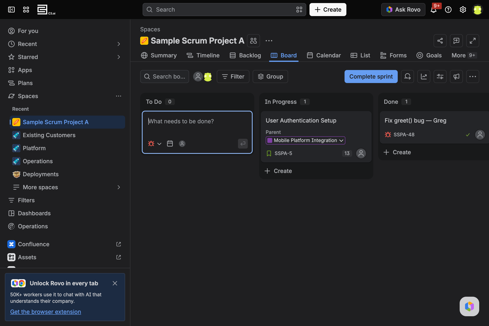
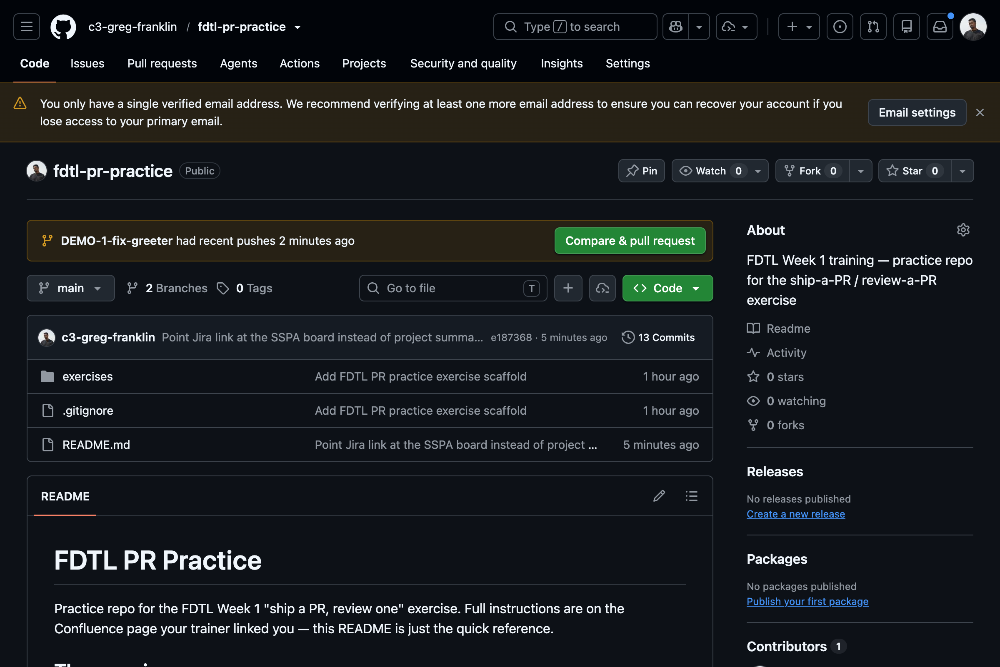
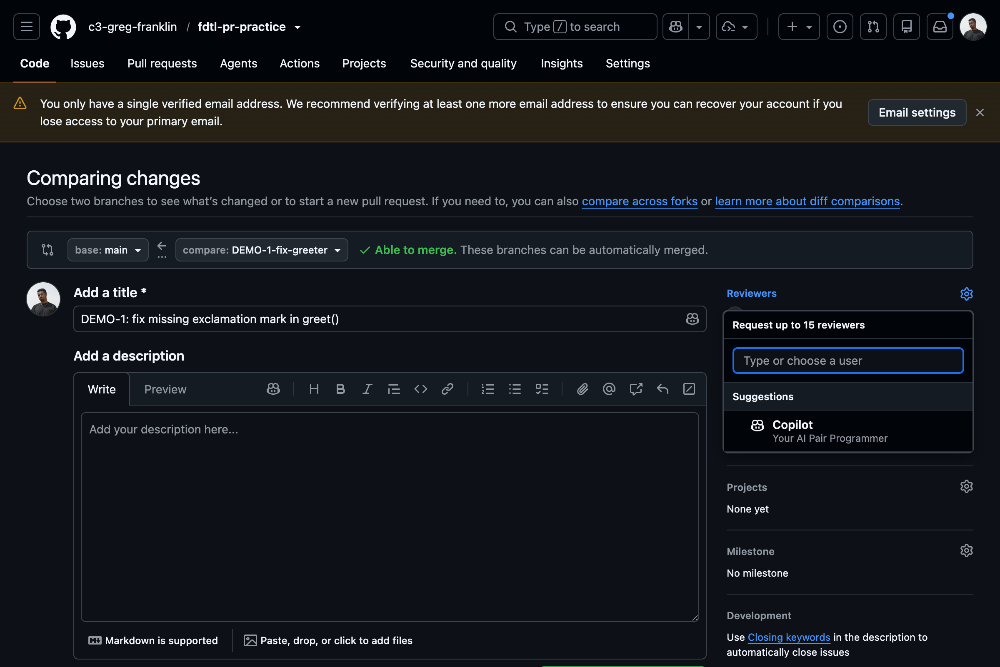
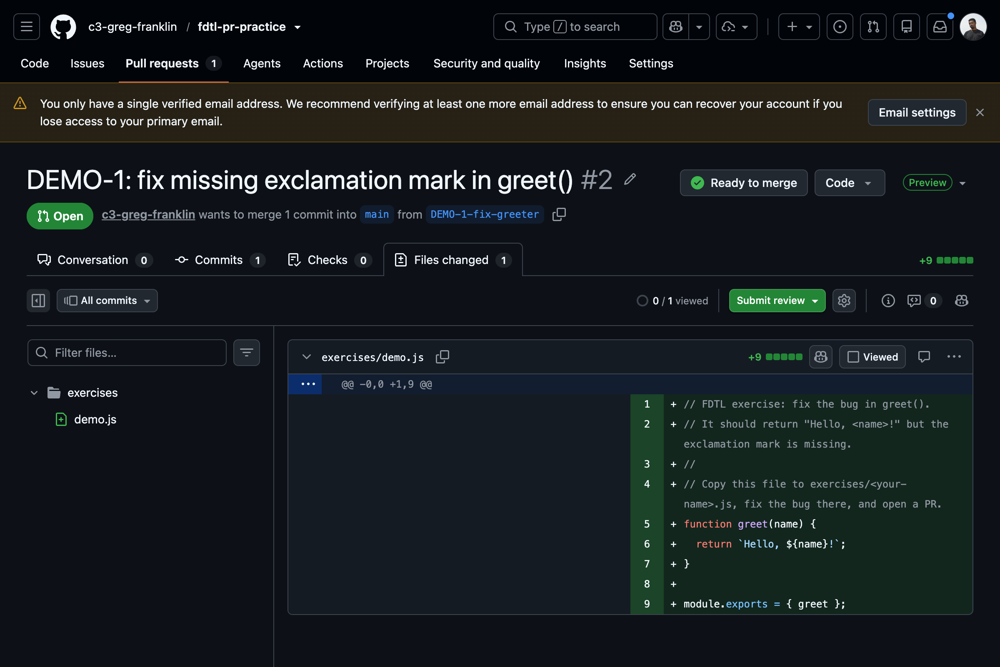
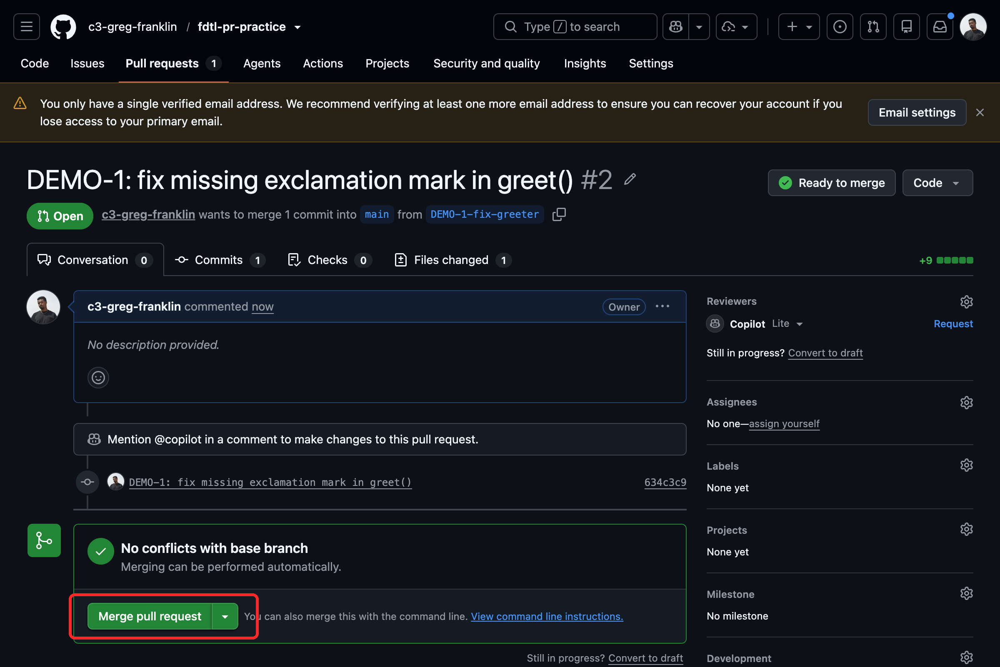

# FDTL PR Practice

Practice repo for the FDTL Week 1 "ship a PR, review one" exercise. Your trainer will walk through this live, but there's enough detail here to follow along on your own if you want to.

**The goal:** go through the full loop a real change takes — a ticket, a branch, a fix, a pull request, a review, and a merge — on a throwaway repo where nothing can break. The actual code change is tiny on purpose; the point is the *workflow*, not the code.

Everyone works in their own file under `exercises/`, so your pull request will never collide with anyone else's — you can all push to the same repo at the same time.

## The exercise

### 1. Clone the repo

Cloning downloads a copy of the repo to your machine. It lands in whatever folder your terminal is currently in, so first decide where you want it to live — otherwise it'll drop wherever your terminal happened to open.

To find a good spot, look around your folders first. `ls` lists what's in the folder you're in, and `cd` moves you into one:

```bash
ls                         # see the folders here
cd ~/Dev                   # move into the one you want (e.g. a "Dev" folder)
ls                         # confirm you're where you expect
```

`~` is your home folder, so `cd ~/Dev` goes to the `Dev` folder inside your home directory. Pick (or make) a folder you'll remember — this is where the project will live and where you'll open your terminal every time you work on it.

Once you're in the folder you want, clone the repo and step into it:

```bash
git clone https://github.com/c3-greg-franklin/fdtl-pr-practice.git
cd fdtl-pr-practice
```

You're now inside the project. The rest of the commands are run from here.

### 2. Create a ticket

Real work starts with a ticket describing what you're going to do. Open the [`SSPA` (Sample Scrum Project A) board](https://c3energy.atlassian.net/jira/software/projects/SSPA/boards/2454?filter=&groupBy=none) in Jira and click **+ Create** in the **To Do** column. Give it a title like `Fix greet() bug — <your name>` and save it.

Jira will assign it a key like `SSPA-123`. **Note that key down — you'll reuse it for your branch, commit, and PR** so everything stays linked together.



### 3. Branch off the ticket

A branch is your own isolated copy of the code to work on, so `main` stays clean until your change is reviewed. Name it after your ticket key so it's obvious what it's for:

```bash
git checkout -b <your-ticket-key>-fix-greeter
```

`git checkout -b` creates the branch and switches you onto it in one step.

### 4. Copy the template

`exercises/TEMPLATE.js` has the bug in it. Copy it to a file named after yourself so you have your own copy to edit:

```bash
cp TEMPLATE.js <your-name>.js
```

### 5. Fix the bug — with Claude Code

The bug: `greet()` should return `"Hello, <name>!"` but it's missing the exclamation mark. Instead of editing by hand, use Claude Code so you get a feel for the agentic loop. Open it in the repo:

```bash
claude
```

Then give it this prompt:

```
In exercises/<your-name>.js, greet() should return "Hello, <name>!" but it's missing the exclamation mark — fix it.
```

Claude will show you a diff of what it wants to change. **Read the diff before you accept it** — confirming an agent's change is a habit worth building now, because you'll do it on real code later.

### 6. Test it

Confirm the fix actually works before you share it:

```bash
node -e "console.log(require('./<your-name>.js').greet('World'))"
```

You should see `Hello, World!`. If you don't, go back to step 5.

### 7. Push your branch

Right now your change only exists on your laptop. Pushing sends your branch up to GitHub so a PR can be opened from it.

First, check what git sees. `git status` shows which files have changed and whether they're staged (marked to be saved) yet:

```bash
git status
```

Your new file will show up in red under **Untracked files** — that means git sees it but isn't tracking it yet.

Stage your change (marks it to be saved):

```bash
git add <your-name>.js
```

Run `git status` again — your file now shows in green under **Changes to be committed**, confirming it's staged:

```bash
git status
```

Commit it (saves a snapshot, with a message referencing your ticket key):

```bash
git commit -m "<your-ticket-key>: fix missing exclamation mark in greet()"
```

Push it up to GitHub:

```bash
git push
```

### 8. Open a PR

A pull request (PR) is how you propose your branch be merged into `main`, and where the review happens. Go to the [repo on GitHub](https://github.com/c3-greg-franklin/fdtl-pr-practice) — right after your push it shows a green **Compare & pull request** button. Click it.



Fill in a title and description that reference your ticket key, leave the base as `main`, and create the PR. Then, in the **Reviewers** panel on the right, add your assigned partner so they get notified there's something to review.



### 9. Review someone else's PR

Once your partner adds you as a reviewer, their PR shows up under the repo's **Pull requests** tab. Open it and click **Files changed** to see exactly what they changed. Hover over a line to leave an inline comment, then click **Review changes** (top right) to approve or request changes.



### 10. Merge it

Once your reviewer approves, your change is ready to go into `main`. On your PR's page, click the green **Merge pull request** button, then **Delete branch** to clean up (the branch has done its job). Last thing: move your Jira ticket to **Done**.



That's the whole loop. On a real team it's the same steps — just bigger changes and stricter reviews.
